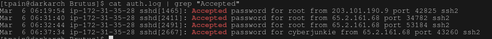
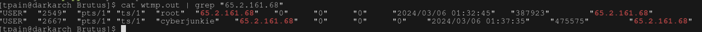
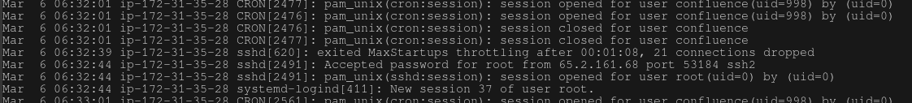
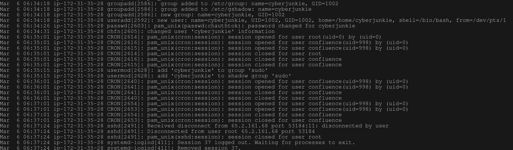
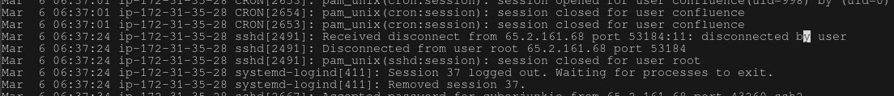
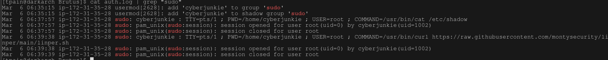

# Brutus

- This is important for analyzing wtmp and auth.log files for unix related operating systems. Showing brute force attacks and creating a timeline of events is crutial for cybersecurity analysts after an incident has occurred.

## Question 1

Analyze the auth.log. What is the IP address used by the attacker to carry out a brute force attack?
- By greping for failed login attempts on the auth.log it is shown that it is all coming from the same IP address which can be recorded as 65.2.161.68

## Question 2

The bruteforce attempts were successful and attacker gained access to an account on the server. What is the username of the account?
- By greping for Accepted logins, it can be seen that the username of the account that the user was able to log in to was root.

## Question 3

Identify the UTC timestamp when the attacker logged in manually to the server and established a terminal session to carry out their objectives. The login time will be different than the authentication time, and can be found in the wtmp artifact.
- In order to view wtmp files there are a couple of ways:
--Running the command: last -f wtmp 
--This will show the file contents quickly
-A script was provided for this investigation to and can be outputed into a file with the command: ./wtmp.py -o wtmp.out wtmp
-This way you can grep for the terminal session for the manual login.
-The event with the USER entry on a pts/* is what you are looking for (reflects a pseudoterminal-classive sign of interactive session over ssh)
-The outfile can also be searched for the IP address of the attacker that was discovered in question 1 which will give you the timestamp.

## Question 4

SSH login sessions are tracked and assigned a session number upon login. What is the session number assigned to the attacker's session for the user account from Question 2?
-If you search auth.log for the accepted passsword again like in question two with the line numbers showing (grep -n) you can see that the second to last accepted password is on line 322. If you go into the auth.log file after that line you can see a session was created and was given a session ID of 37

## Question 5

The attacker added a new user as part of their persistence strategy on the server and gave this new user account higher privileges. What is the name of this account?
-It can be seen in the auth.log file that a user created after the session was established. If you look at the file you can see that the name of the user was cyberjunkie and was given sudo privledges. 

## Question 6

What is the MITRE ATT&CK sub-technique ID used for persistence by creating a new account?
-The MITRE ATT&Ck technique was T1136 for creating a new user
-It has thre sub-techniques:
--001 for local user creation
--002 for domain user creation
--003 for cloud user creation
[Link to MITRE ATT&CK T1136 for more information](https://attack.mitre.org/techniques/T1136/)

## Question 7

What time did the attacker's first SSH session end according to auth.log?
-It can be seen after the user creation that the session was ended. The file could be searched for items with the term 37 for the session or could just scroll down and see the time for the end of the session.
-This had the 37 session log out and and removal for the session. 

## Question 8

The attacker logged into their backdoor account and utilized their higher privileges to download a script. What is the full command executed using sudo?
-If you search the auth.log for sudo you will see all of the commands that cyberjunkie used with sudo since you have to authenticate to utilize it.
It can be that a script was downloaded using curl from githubusercontent.com

# Timeline

A timeline of the events that occured.
* 2024-03-06 06:31:31 the brute force attack begins from the IP address 65.2.161.68
* 2024-03-06 06:31:40 the password was first accepted from the IP address 65.2.161.68 with the user being root
* 2024-03-06 06:32:45 a terminal session for the user root was first established from the IP address 65.2.161.68 (session 37)
* 2024-03-06 06:34:18 a new user was added named "cyberjunkie", user was added to the sudoers group
* 2024-03-06 06:37:24 the session for user root was terminated from the IP address 65.2.161.68
* 2024-03-06 06:37:34 a new terminal session for the user cyberjunkie was established from IP address 65.2.161.68 (session 49)
* 2024-03-06 06:37:57 user cyberjunkie used sudo to view the /etc/shadow file
* 2024-03-06 06:39:38 user cyberjunkie used sudo and curl to download a script from https://raw.githubusercontent.com/montysecurity/linper/main/linper.sh
